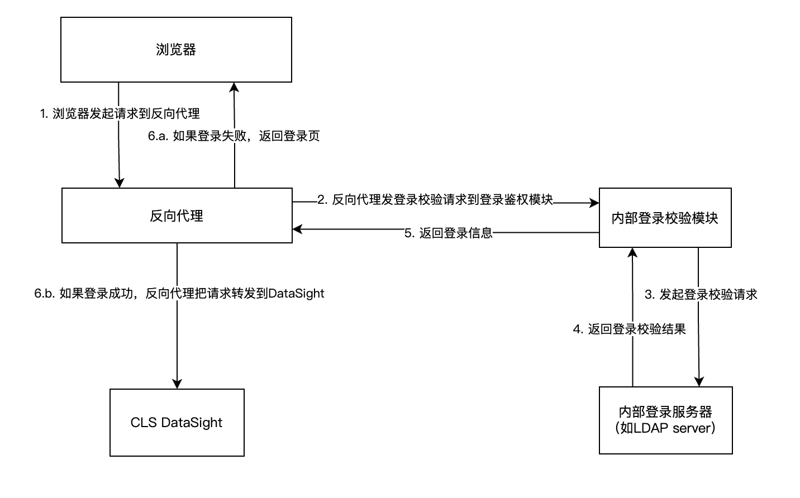

# 腾讯云日志服务 CLS DataSight 登录校验代理

如需对接内部用户管理系统（LDAP、OAuth等），并通过内部系统的用户名、角色访问 DataSight，可通过反向代理实现。

### 基本原理

Nginx等反向代理软件，可支持作为前置登录校验模块部署，对接内部登录系统。

用户完成登录操作后，反向代理才会把请求转发到受保护的后端服务(DataSight)。

DataSight“登录方式”选择“第三方认证登录”后，DataSight 自身将不做登录校验，而是根据反向代理传入的登录信息header判断用户身份。

这种实现方式，使用者可以完全掌控内部登录校验模块，不会将内部登录密码等敏感数据传递到DataSight，保证信息安全。



### 使用参数

反向代理软件发往DataSight的请求中，通过 header `X-DATASIGHT-USER` 指定用户名，`X-DATASIGHT-ROLE` 指定角色名。

如需要一次传入多个角色名，也可通过 `X-DATASIGHT-ROLES` 传入，接受格式： 1. 英文逗号分隔的字符串 `role1,role2` 或 2. JSON数组字符串 `["role1", "role2"]`。DataSight将使用第一个作为角色名。

### 前置条件

参考[DataSight文档](https://cloud.tencent.com/document/product/614/39331)，在腾讯云控制台 CLS DataSight 处完成配置，开启 DataSight "第三方认证登录"能力。

完成配置后，在腾讯云私有网络环境 或 与腾讯云私有网络互通的环境中，通过命令行调试

```
curl -X POST -H "X-DATASIGHT-USER:your_user" -H "X-DATASIGHT-ROLE:your_role" https://datasight-111111111.internal.clsconsole.tencent-cloud.com/api/user
```

1. 如果返回 

```
{"isLoggedIn":true,"domain":"datasight-111111111.internal.clsconsole.tencent-cloud.com","username":"your_user","role":"your_role","isAuthProxy":true}
```

则表示DataSight登录校验代理访问正常，并已自动通过header登录信息完成登录。

2. 如果返回 

```
{"isLoggedIn":false,"domain":""}
```

则表示DataSight登录代理访问正常，但未完成登录，X-DATASIGHT-ROLE 的值所表示的角色名，在DataSight配置中未找到。

3. 如果返回

```
intranet access denied: xxxx
```

则表示当前 VPC 或 IP 不允许访问，请根据报错信息调整 DataSight 配置，或改在配置的私有网络或IP地址发起调试。

### 目录

具体示例内容请进入对应目录查看：

[LDAP](./ldap/README.md)

[OAuth](./oauth/REAEME.md)


### 参考资料

https://docs.nginx.com/nginx/admin-guide/security-controls/configuring-subrequest-authentication/

https://www.nginx.com/blog/nginx-plus-authenticate-users/

https://www.nginx.com/blog/validating-oauth-2-0-access-tokens-nginx/

