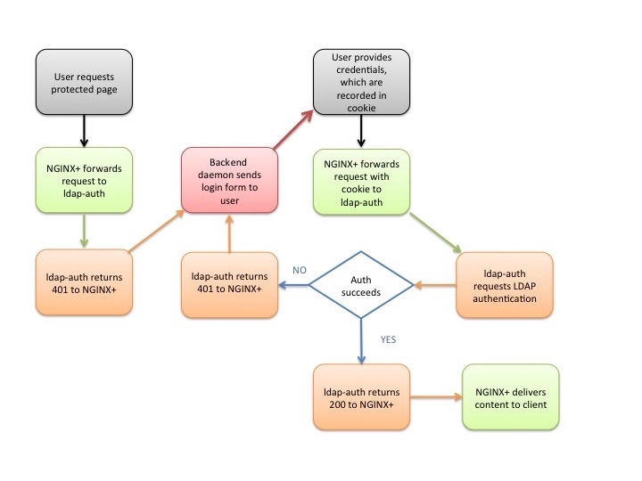

# 腾讯云日志服务 CLS DataSight 登录鉴权代理 - LDAP

如需对接内部LDAP，并通过LDAP的用户名、角色访问 DataSight，可通过反向代理实现。

本示例提供基于Nginx实现的示例。

### 基本原理

[腾讯云日志服务 CLS DataSight 登录校验代理](../README.md)

本示例利用 Nginx [auth_request](https://nginx.org/en/docs/http/ngx_http_auth_request_module.html) 模块，访问 DataSight 前先通过本地 nginx-ldap-auth 模块登录校验。

如未登录，则通过本地 nginx-ldap-login 模块展示 LDAP 登录页。输入 LDAP 用户名密码后，重新通过 nginx-ldap-auth 发起登录校验。

登录成功，才把请求转发到DataSight，并在请求中携带 X-DATASIGHT-USER, X-DATASIGHT-ROLE header信息。



### 前置条件

1. 按照 [腾讯云日志服务 CLS DataSight 登录校验代理](../README.md) 中的 前置条件部分，完成 DataSight 配置。建议同时完成 curl 命令请求调试。
2. 如果未安装Nginx，请按照[安装Nginx官方文档](https://www.nginx.com/resources/wiki/start/topics/tutorials/install/)完成安装。 
需确保已安装[ngx_http_auth_request_module](https://nginx.org/en/docs/http/ngx_http_auth_request_module.html) (--with-http_auth_request_module)。

### 使用方式

1. 复制本目录文件到本地。
2. 按实际情况修改 nginx-ldap-auth.conf，放到 Nginx 配置文件中，重启 Nginx 服务。
3. 在 `.env` 文件中按照注释指引，配置 `ENCRYPTION_KEY` 环境变量
4. 运行 LDAP 校验模块、登录模块。

   a. (推荐) 通过docker运行：
    ```
    docker build -f Dockerfile-auth -t nginx-ldap-auth .
    docker build -f Dockerfile-login -t nginx-ldap-login .
    docker run -d -p 8888:8888/tcp --env-file ".env" nginx-ldap-auth
    docker run -d -p 9000:9000/tcp --env-file ".env" nginx-ldap-login
    ```

   b. 也可以本地直接通过 Python 运行。如遇到安装依赖报错，请根据报错提示搜索相关依赖包文档解决。
    ```
    python3 -m pip install python-ldap python-dotenv setuptools_rust cryptography
    nohup python3 nginx-ldap-login.py >login.log 2>&1 &
    nohup python3 nginx-ldap-auth.py >auth.log 2>&1 &
    ```
5. 浏览器访问Nginx配置文件中配置的自定义域名，在弹出的 LDAP 登录页中，输入 LDAP 用户名密码，登录成功后进入 DataSight 页面。

### 参考资料

本目录示例参考[Nginx官方LDAP示例](https://github.com/nginxinc/nginx-ldap-auth)，并做出部分修改以适配DataSight。
