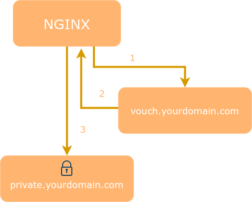

# 腾讯云日志服务 CLS DataSight 登录鉴权代理 - OAuth

如需对接内部OAuth登录系统，通过OAuth授权后，以授权的用户名+角色访问DataSight，可通过反向代理实现。

### 注意

本示例提供基于 Nginx + [vouch-proxy] 实现，您也可以根据实际情况使用其他反向代理软件和OAuth校验软件（如[oauth2-proxy]）。

本示例提供通过 GitHub 和 Keycloak(通用OIDC协议) 登录授权的示例指引。如使用其他 OAuth 提供商，请结合 [vouch-proxy] 或 [oauth2-proxy] 官方指引，参考本示例修改使用。

### 基本原理

[腾讯云日志服务 CLS DataSight 登录校验代理](../README.md)

本示例利用 Nginx [auth_request](https://nginx.org/en/docs/http/ngx_http_auth_request_module.html) 模块，访问 DataSight 前先通过本地 [vouch-proxy] 校验 OAuth 登录授权。

如未登录，则跳转至OAuth提供商页面提示用户授权。授权后，重新通过 [vouch-proxy] 发起 OAuth 登录授权校验。

登录成功，才把请求转发到DataSight，并在请求中携带 `X-DATASIGHT-USER`, `X-DATASIGHT-ROLE` header信息。



### 前置条件

1. 按照 [腾讯云日志服务 CLS DataSight 登录校验代理](../README.md) 中的 前置条件部分，完成 DataSight 配置。建议同时完成 curl 命令请求调试。
2. 如果未安装Nginx，请按照[安装Nginx官方文档](https://www.nginx.com/resources/wiki/start/topics/tutorials/install/)完成安装。
   需确保已安装[ngx_http_auth_request_module](https://nginx.org/en/docs/http/ngx_http_auth_request_module.html) (--with-http_auth_request_module)。

### 使用方式

1. 复制 [github](./github) 或 [keycloak(oidc)](./keycloak(oidc)) 目录到本地。其中 config.yml 是 [vouch-proxy] 配置文件，nginx-xxx.conf 是 nginx 配置文件。
2. 按实际情况修改 nginx-xxx.conf，放到 Nginx 配置文件中，重启 Nginx 服务。
3. 按实际情况修改 config.yml，放到本地 config 文件夹中。
4. 参考 [vouch-proxy] 指引运行 vouch 服务。推荐通过 docker 方式运行：

```
docker run -d \
    -p 9090:9090 \
    -v ${PWD}/config:/config \
    quay.io/vouch/vouch-proxy
```

如果需要 [vouch-proxy] 使用本机网络访问OAuth服务，也可以在 docker run 时指定 --network=host。

5.浏览器访问Nginx配置文件中配置的自定义域名，跳转到OAuth服务提供商页面提示授权，授权成功后进入 DataSight 页面。

### 参考资料

[vouch-proxy]

[oauth2-proxy]

[vouch-proxy]: https://github.com/vouch/vouch-proxy
[oauth2-proxy]: https://github.com/oauth2-proxy/oauth2-proxy
