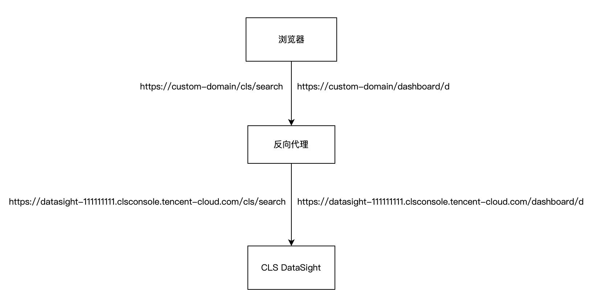

# 腾讯云日志服务 CLS DataSight 配置自定义域名

如需通过自定义域名访问 DataSight，可通过反向代理实现。

本示例提供[Nginx配置文件示例](custom-domain.conf)，使用者按实际情况修改“your-domain.com”、“your-domain-cert”、“datasight-111111111”（datasight域名，支持公网/内网域名）等部分后使用。

注意：为了自定义域名访问安全，强烈建议为自定义域名配置相应https证书后使用。

