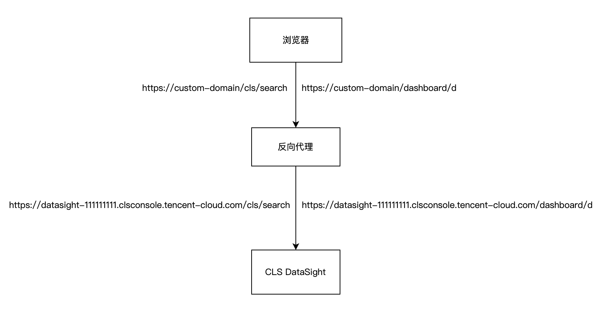

# 腾讯云日志服务 CLS DataSight 配置自定义域名

如需通过自定义域名访问 DataSight，可通过反向代理实现。

本示例提供[Nginx配置文件示例](custom-domain.conf)，使用者按实际情况修改“your-domain.com”、“your-domain-cert”、“datasight-111111111”（datasight域名，支持公网/内网域名）等部分后使用。

注意：为了自定义域名访问安全，强烈建议为自定义域名配置相应https证书后使用。

### DataSight 域名说明

CLS DataSight 当前同时支持两套域名：

| 类型 | 示例 | 适用范围 |
| --- | --- | --- |
| 新域名 | `xxxxx(.internal)?.clsconsole.tencentcls.com` | **后续新增实例只支持新域名**；老实例若已分配也可访问 |
| 老域名 | `xxxxx(.internal)?.clsconsole.tencent-cloud.com` | 仅老实例可用，不会下线；新增实例不会再分配老域名 |

接入步骤：

1. **先在控制台或云API查询您 DataSight 实例的实际域名**：登录腾讯云 [CLS DataSight 控制台](https://console.cloud.tencent.com/cls) 在实例详情/域名信息中查看，或通过云API读取实例的域名字段；
2. 将示例配置中 `proxy_pass` 后的域名替换为您实例的实际域名（示例默认占位为新域名 `clsconsole.tencentcls.com`，若您实例为老域名实例，请改为 `clsconsole.tencent-cloud.com`）；
3. 示例配置中的 `proxy_redirect` 正则已通过 `(?:tencent-cloud|tencentcls)` 同时兼容新旧域名，无需修改；
4. `reload nginx` 即可生效，无需重启自定义域名服务。

